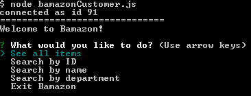
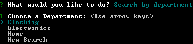
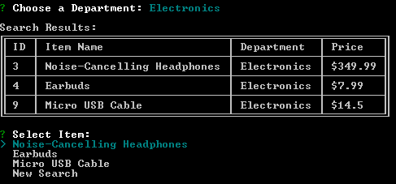
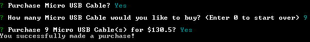
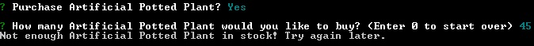
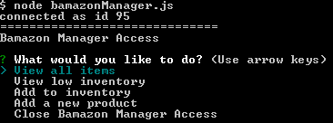
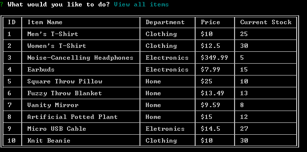
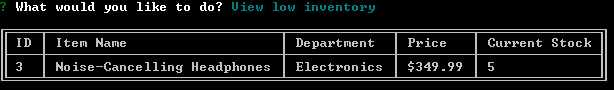
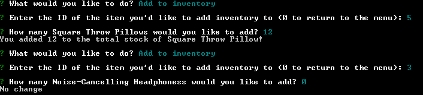
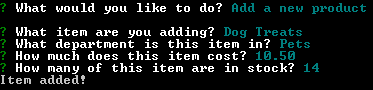

# bamazon

Bamazon is a node.js command line app that makes use of a mySQL database.

By running `bamazonCustomer.js`, the user can:
* Search the bamazon database for an item through the following methods:
  * View all items, and select an item ID
  * Search by ID
  * Search by name
  * Search by department
* Simulate the purchase of an item from this database 
  * When purchasing an item, the change in stock is reflected in the database.

By running `bamazonManager.js`, the user can:
* View all items in the bamazon database
* View all items in the bamazon database with 5 or fewer of that item currently in stock
* Add to the current inventory for a specific item
* Add a new item to the database

- - -
## Installation
* Using the command line, cd into the directory, and run ```npm install```
* Create a ```.env``` file in the direcory with the following contents:
```js
# mySQL password

MYSQL_PASSWORD=your-mysql-password
```
* NOTE: This step may not be necessary if you do not have a password for accessing your mySQL database.
* Initialize a mySQL database called bamazon_db by running the contents of bamazon_db.sql in MySQL Workbench or a similar program.

- - -
## bamazonCustomer.js

### Main Menu


#### Search by Department



#### Purchasing Interface



- - -
## bamazonManager.js

### Main Menu


#### View All Items


#### View Low Inventory


#### Add Stock


#### Add New Item


- - -
## NPM Packages Used
   * [DotEnv](https://www.npmjs.com/package/dotenv)
   * [Inquirer](https://github.com/SBoudrias/Inquirer.js#inquirerjs)
   * [mysql](https://www.npmjs.com/package/mysql)
   * [Table](https://www.npmjs.com/package/table)